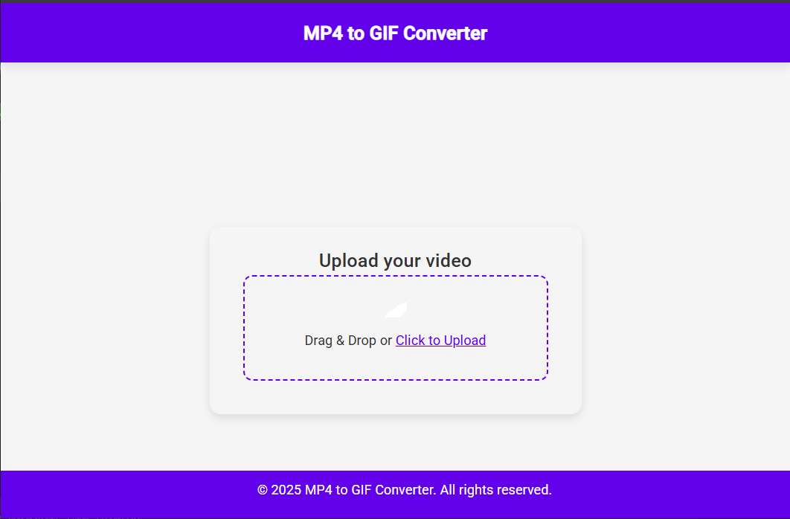

# MP4 to GIF Converter

Full-stack portfolio demo for asynchronous video conversion: Angular uploads a short MP4, Express queues it in BullMQ/Redis, a separate FFmpeg worker creates a GIF, and Socket.IO reports progress.



## Run

```sh
docker compose up --build
```

Open http://localhost:8080. The command starts `frontend`, `api`, `worker`, and `redis`; healthchecks ensure API and worker wait for Redis.

## Architecture

```text
Angular/Nginx -> Express + Socket.IO -> Redis/BullMQ -> FFmpeg worker
                           shared conversion-file volume
```

The source MP4 is removed after successful conversion. GIFs are removed after download or by a TTL sweep (default one hour). Configure `FRONTEND_PORT`, `FILE_TTL_SECONDS`, `GIF_WIDTH`, `GIF_HEIGHT`, and `GIF_FPS` in `.env` (see `.env.example`).

## Checks

```sh
cd backend && yarn lint && yarn test
cd ../frontend && yarn build
```

## Limits

- MP4 only; maximum upload size is 50 MB.
- This is a demonstration project, not a throughput benchmark.
- A shared Docker volume supports a single-host Compose setup. Multi-node Swarm needs shared or object storage before workers are distributed between hosts.
